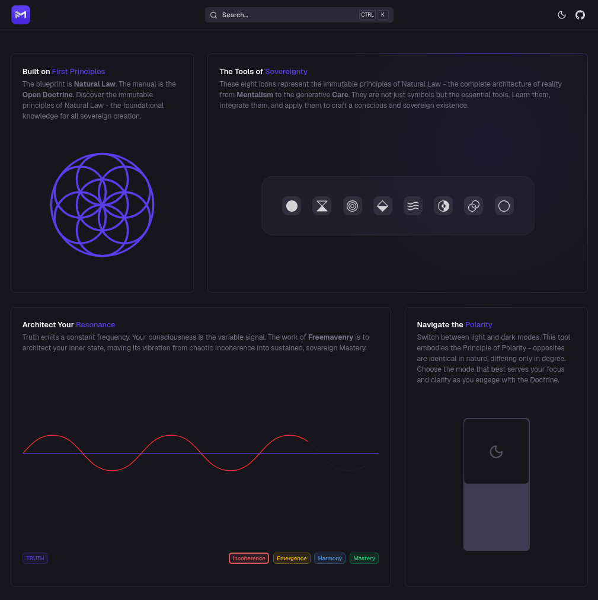

# The Open Doctrine

<a href="https://docs-template.nuxt.dev/" target="_blank">
  <picture>
    <source media="(prefers-color-scheme: dark)" srcset="./public/img/assets/tfm-doctrine-home-screenshot-dark.png">
    <source media="(prefers-color-scheme: light)" srcset="./public/img/assets/tfm-doctrine-home-screenshot-light.png">
    
  </picture>
</a>
